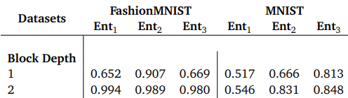

# QAS_Huawei
Intership of Quantum Architecture Search(QAS)
本仓库用于更新关于 量子结构搜索的课题进展  
## 1. 结题目标:  
根据开源任务的要求,对于量子神经网络中手写MNIST数据集中的二分类问题(暂定是数字 3 和 6)分类准确度达到 95%+, 在此过程需要基于不同的 QAS 方法对于量子神经网络进行结构搜索, 以寻找到更优 Ansatz结构.  

## 2.两种方法:  
### 2.1. GS-QAS方法
基于自监督学习的方法,对于量子神经网络进行结构搜索.具体参见[GS-QAS](https://arxiv.org/abs/2101.04038)
### 2.2. DQAS方法
基于可微结构搜索的思想 ,对于量子神经网络进行结构搜索.具体参见[DQAS](https://arxiv.org/abs/2101.04038)

## 3. 目前问题:  
### 3.1. GS-QAS方法
由于原文中的实验是使用到了 16-18个量子比特完成的 QNN，并且并没有明确到底是完全的 QNN,还是混合神经网络(QNN+BP 全链接神经网络) 原文的方法准确度非常高 95%+ 所以我认为很有可能是量子混合神经网络，因为在[这篇文章中](https://arxiv.org/abs/2101.04038)中提到，大部分的 Ansatz 都很难在手写数字MNIST 数据集中表现良好，最好的结果不到 88%,而只能在时尚 MNIST数据集中表现良好，所以我认为原文方法应该是在混合神经网络中表现良好，而不是纯量子神经网络.  
原文中识别精度：

复现结果：

| Block Depth | FashionMNIST Ent1 | FashionMNIST Ent2 | FashionMNIST Ent3 | MNIST Ent1 | MNIST Ent2 | MNIST Ent3 |
| :---------: | :---------------: | :---------------: | :---------------: | :--------: | :--------: | :--------: |
|      2      |       0.996       |       0.990       |       0.982       |   0.677    |   0.844    |   0.868    |  

可以看出来在 手写数字MNIST 数据集上的准确度不够好于时尚MNIST数据集，所以我认为应该是混合神经网络.

然而,GS-QAS的方法中 分为两部分：1.VGAE的训练(生成器部分) 我使用了 5000个使用基础门集合的随机线路作为训练数据,原始数据在[这里|[A,X]](./VGAE_dataset/raw) 数据生成过程在[这里](./生成%20VGAE%20的随机线路数据集.ipynb) 此部分没有问题, VGAE 的模型权重参数在[这里](./vgae_model.pth) 2.制作下游预测器 和 预测器会用到的小规模样本集,形式是"[Ansatz1,82%],[Ansatz2,76%],[Ansatz3,68%],[Asantz4,93%]" Ansatz的结构表示+其在测试中的准确度得分，下游预测器结构很简单 论文里也直接给出，但是样本集的测试分获取有问题。  

测试分的问题是：对于相同的 Ansatz,不同的数据编码方案、不同的结构(是否是量子混合神经网络)带来的测试分相差太大. 目前的组合可以有: 振幅编码方案、IQP 编码方案、PCA主层次编码方案、量子混合神经网络(QNN+全连接)、纯量子神经网络QNN 所以用到的比特数可以是 7,8,10,16   
总之 目前的组合较多 所以下游预测器的数据集还没有确定好 比如：[Ansatz1,72%]是使用8比特振幅编码的QNN，那么下游预测器的训练只能转为这一种编码方案，并且上游的生成器也要专为8比特的情况来训练。  

总结: 由于上游生成器、下游预测器需要用一套方案(比特数目保持一致)来评估,因此下游预测器要训练多个.  
这里也是重点创新之处: 原文使用越少编码方案的组合，就要求 ansatz深度大增才能保持高准确度。 如果本课题使用 8 比特的编码方案 准确度接近 但 ansatz 深度大大降低 也是重要创新点。

### 3.2. DQAS方法
目前DQAS方法在MNIST数据集上的分类准确度只有 85% 左右,需要进一步优化.

